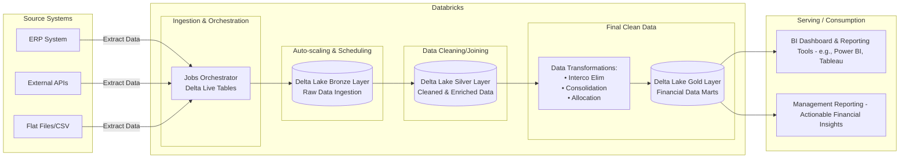

# Transforming Finance with Databricks

**Welcome to the future of finance.**  
<code>Psst. It applies to HR and other functions too!</code>  
Say goodbye to clunky spreadsheets and endless manual tasks. Databricks unifies, scales, and automates everything—from data intake to real-time analytics. Whether you’re a seasoned finance pro or just starting your data journey, this guide shows how Databricks flips the old ways on their head, paving the road to smarter P&L forecasting and adaptive planning for production and human capital.

---

## What Is Databricks?

Databricks is your all-in-one, cloud-based data powerhouse built on Apache Spark. It blends data engineering, data science, and analytics so you can:

- **Integrate Everything:**  
  Connect easily to ERP systems, external APIs, flat files, and more.
- **Transform Fast:**  
  Leverage the Medallion Architecture (Bronze, Silver, Gold) to convert raw data into trusted insights.
- **Analyze in Real Time:**  
  Run powerful analytics and machine learning alongside popular BI tools like Power BI and Tableau.

This unified approach crushes data silos and delivers insights at lightning speed.

---

## The Data Journey on Databricks

Watch your data move from source to insight in three simple steps:

### 1. Data Ingestion
- **Gather Everything:**  
  Your vital data comes directly from ERP systems, APIs, and flat files.
- **Automated Onboarding:**  
  Tools like Delta Live Tables automatically ingest and schedule your data.

### 2. Processing with the Medallion Architecture
- **Bronze Layer:**  
  Store raw, untouched data, keeping all the original details intact.
- **Silver Layer:**  
  Automated quality checks and basic cleaning transform raw data into reliable info.
- **Gold Layer:**  
  Advanced transformations—eliminating intercompany transactions, consolidating subsidiaries, and allocating expenses—build business-ready data marts.

### 3. Analytics & Reporting
- **Direct BI Integration:**  
  Gold-layer data flows straight into dashboards using tools like Power BI or Tableau.
- **Instant Insights:**  
  Real-time, interactive reports empower smarter budgeting, forecasting, and compliance.

---

## Databricks: Driving Business Transformation

For finance teams stuck in outdated processes, Databricks is a total game changer:

- **Streamlined Processes:**  
  Automation eliminates tedious manual work.
- **Reliable Data:**  
  A multi-layered approach ensures high-quality, trustworthy insights.
- **Agile Decisions:**  
  Real-time data lets you pivot quickly as market conditions change.
- **Smart Spending:**  
  Dynamic scaling keeps costs in check as you grow.

---

## Cost Considerations

Worried about setup costs? Here’s a quick snapshot:

- **Entry-Level Setup:**  
  Small clusters run around **\$0.15 to $0.55 per DBU (Databricks Unit) per hour.**
- **Monthly Spend:**  
  Light usage might cost a few hundred dollars per month, while larger deployments can run into the thousands.

These are rough estimates—always check the official [Databricks Pricing Page](https://databricks.com/product/pricing) for the latest details.

---

## Key Takeaways

- **Unified and Scalable:**  
  One platform for data ingestion, processing, and analytics.
- **Enhanced Decision-Making:**  
  Real-time insights drive sharper business choices.
- **Business Transformation:**  
  Automate elimination, consolidation, and allocation to modernize finance operations.
- **No More Hanging Excel Files:**  
  Databricks handles massive data volumes and heavy computation effortlessly.
- **Manual Work is a Thing of the Past:**  
  Integrated automation wipes out tedious manual tasks.

Embrace Databricks and step into a future where finance becomes a strategic, data-driven powerhouse. Whether you’re consolidating reports or streamlining cost allocation, this platform makes smart, modern finance accessible to all.