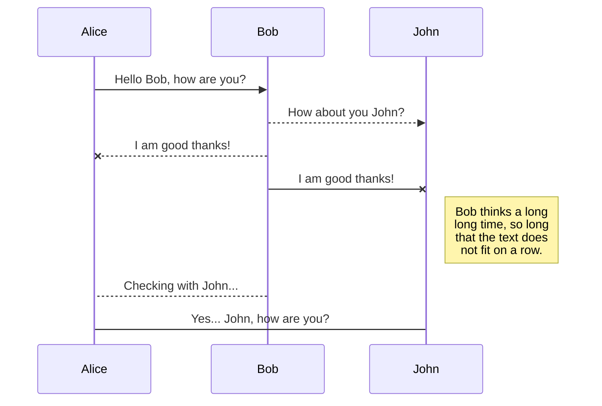

# databrick
Some info for me to keep track of my learning with Databricks

hello

asdf 
asdfj



Test Image:


And this will produce a flow chart:

```mermaid
graph LR
A[Square Rect] -- Link text --> B((Circle))
A --> C(Round Rect)
B --> D{Rhombus}
C --> D